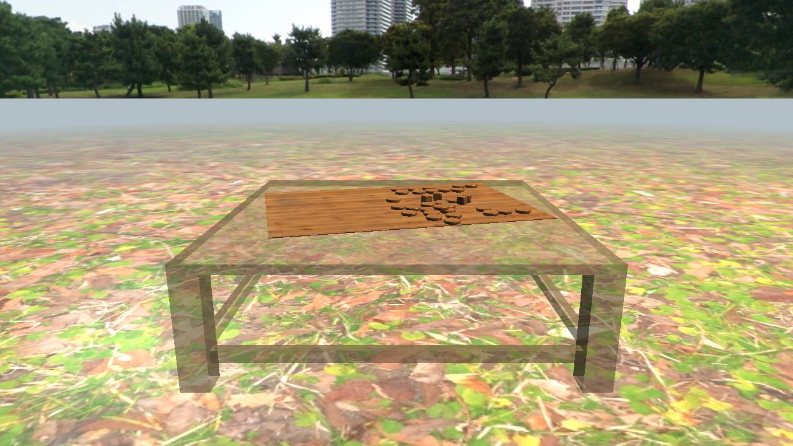

# Backgammon OpenGL Scene

An interactive 3D rendering demo built in **C with OpenGL 3.3 and GLSL**. A rotating wooden backgammon board sits on a transparent glass table, surrounded by textured ground, a photographic skybox, and distance fog.

Developed as a **group project for Computergrafik 1 at Hochschule Hannover, summer semester 2026**.



*Actual OpenGL framebuffer capture at 1280 × 720 using the bundled assets. Asset credits are listed in [CREDITS.md](CREDITS.md).*

## Rendering features

- Custom matrix library for translation, rotation, scaling, perspective projection, view transforms, and normal matrices.
- OBJ mesh loading and GPU vertex-buffer setup.
- Three vertex/fragment shader pairs: Phong lighting, transparent textured objects, and cubemap skybox rendering.
- Two light sources with ambient, diffuse, and specular lighting.
- JPG/PNG image loading through `stb_image`, plus a custom PPM P3 loader.
- Alpha blending for the glass tabletop, legs, and crossbars.
- A six-face environment cubemap and distance-based fog.
- Time-based board rotation and a first-person camera controlled with WASD and the mouse.

## Technology

| Component | Technology |
| --- | --- |
| Application | C |
| Graphics API | OpenGL 3.3 Core |
| Shaders | GLSL 330 |
| Window and input | GLFW |
| OpenGL function loading | GLEW |
| Image decoding | stb_image 2.30 |
| Build | GCC, GNU Make, pkgconf |
| Assets | Wavefront OBJ/MTL, JPG, PPM P3 |

## Build and run

The application requires an OpenGL 3.3-capable graphics driver. Run it from the repository root so that relative `assets/` and `shaders/` paths resolve correctly.

### Windows — MSYS2 MINGW64

Install [MSYS2](https://www.msys2.org/), open its **MINGW64** terminal, and install the dependencies:

```sh
pacman -S --needed mingw-w64-x86_64-gcc mingw-w64-x86_64-make mingw-w64-x86_64-pkgconf mingw-w64-x86_64-glew mingw-w64-x86_64-glfw
```

Change to the project folder, then:

```sh
mingw32-make cg1
./cg1.exe
```

If building from PowerShell instead, put `C:\msys64\mingw64\bin` first on PATH for that terminal session. The same directory must be available when running the executable so its library DLLs can be found.

### Linux — Debian/Ubuntu

```sh
sudo apt install build-essential libglew-dev libglfw3-dev pkgconf
make cg1
./cg1
```

Windows compilation and a render smoke check were verified. The Linux build configuration selects `-lGL`, but was not run during this preparation. macOS is not covered by these instructions.

## Controls

The application opens fullscreen on the primary monitor and captures the mouse.

| Input | Action |
| --- | --- |
| W / S | Move forward / backward |
| A / D | Strafe left / right |
| Mouse | Look around |
| Esc | Exit |

## Existing tests

```sh
mingw32-make tests
./test_mat4.exe
./test_obj_loader.exe
./test_ppm_loader.exe
```

On Linux, use `make tests` and omit `.exe` from the executable names.

The supplied tests exercise matrix operations, five simple OBJ fixtures, and three PPM textures. Inspect the matrix test's printed results: its original implementation does not return a failure status for failed comparisons, and its perspective check prints values without an assertion.

During preparation, all nine reported matrix comparisons passed, all five OBJ fixtures loaded, and all three PPM fixtures loaded. A separate temporary render harness loaded the full scene, compiled the shaders, and captured a frame without a reported OpenGL error. Interactive input and prolonged fullscreen operation were not manually tested.

## Team and contributions

The contribution breakdown below is preserved from the original project README.

| Team member | Contribution |
| --- | --- |
| Zhina Bagheri | Matrix library and test functions |
| Yashar | Shader system and lighting |
| Sepehr Salehi | OBJ import, mesh management, and PPM texture loader |
| **Mahdi Roustaei** | **Camera, animation, user interaction, scene composition, JPG/PNG image-texture loader, and skybox** |

This is a shared university project. Third-party models, textures, and libraries are credited separately from the team's implementation.

## Structure

```text
backgammon-opengl/
├── README.md
├── CREDITS.md
├── .gitignore
├── makefile
├── docs/scene.png
├── assets/
│   ├── models/       # Backgammon model and simple geometry fixtures
│   ├── textures/     # Wood, grass, and PPM textures
│   └── skybox/       # Six cubemap faces
├── shaders/          # Three vertex/fragment shader pairs
└── src/
    ├── main.c
    ├── stb_image.h
    ├── math/
    ├── graphics/
    ├── geometry/
    ├── texture/
    ├── render/
    └── tests/
```

## Scope and further work

The board is a visual scene asset in a graphics demonstration. The OBJ importer expects triangulated faces with position/UV/normal indices and does not implement a general material pipeline. The included MTL file is retained with the model; rendering applies the scene's own texture setup.

The renderer uses basic transparency without camera-dependent sorting of the glass parts. Lighting normal-space consistency during camera rotation, input/loader validation, and stronger automated assertions are areas for improvement. The supplied rendering source and shaders are preserved in this portfolio copy.

## Credits and licensing

The board model is credited to **Requital (Azamkhon)** under CC BY 4.0, the **Yokohama 2** skybox to **Emil Persson (Humus)** under CC BY 3.0, and the wood/grass textures to **Poly Haven** under CC0. See [CREDITS.md](CREDITS.md) for source links and modification notes.

The original archive does not specify a general license for the team's code. No new project-wide license has been added. Third-party assets and `stb_image` retain their own licenses and notices.
